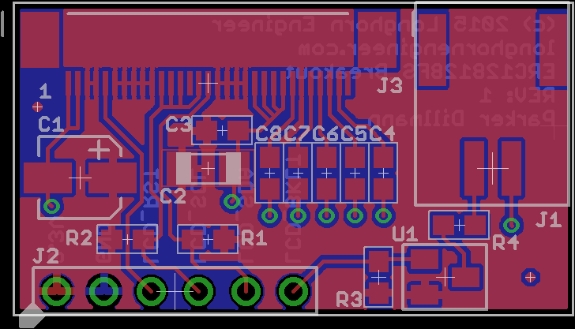

###ERC128128FS Breakout Board
***
**Quick and dirty breakout board for ERC1281FS LCD Panels**

Display can be found [here](http://www.buydisplay.com/default/2-2-inch-serial-i2c-cog-lcd-128x128-graphic-display-module-black-on-white).
J1 is a ER-CON2.0-2P-SMD found [here](http://www.buydisplay.com/default/2-pins-2-0mm-pitch-smd-horizontal-backlight-connector).
J3 is a ER-CON31HT-1 found [here](http://www.buydisplay.com/default/31-pin-0-5mm-pitch-top-contact-zif-connector-fpc-connector).

Display is controlled via I2C.
LCD_BKLT is active low. Pulling it low will enable the backlight. Should be PWM controllable. 

***

***

Files are for Eagle V6.0+. See main directory for licensing. 
